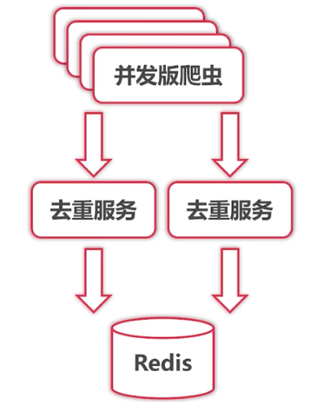

# GoLang基础

> 学习资料：https://golang-tech-stack.com/tutorial/golang/intro
>
> https://www.runoob.com/go/go-tutorial.html
>
> https://www.bilibili.com/video/BV1zR4y1t7Wj?p=1&vd_source=616bf6a004def119a1b27e570687e7ea

## 1，基本知识

#### 1）goLang基本概念

`Go`（又称 `Golang`）是 `Google` 的 `Robert Griesemer`，`Rob Pike` 及 `Ken Thompson` 开发的一种静态强类型、编译型语言。`Go` 语言语法与 `C` 相近，但功能上有：内存安全，`GC`（垃圾回收），结构形态及 `CSP-style` 并发计算。

- `go` 语言特点

> 1）背靠大厂，`google` 背书，可靠
>
> 2）天生支持并发（最显著特点）
>
> 3）语法简单，容易上手
>
> 4）内置 `runtime`，支持垃圾回收
>
> 5）可直接编译成机器码，不依赖其他库
>
> 6）丰富的标准库
>
> 7）跨平台编译

`Go` 语言被设计成一门应用于搭载 `Web` 服务器，存储集群或类似用途的巨型中央服务器的系统编程语言。

对于高性能分布式系统领域而言，`Go` 语言无疑比大多数其它语言有着更高的开发效率。

#### 2）`Go` 基础安装及配置

> 官网地址：https://go.dev/

```bash
# 查看版本
☁  ~  /usr/local/go/bin/go version
go version go1.19.1 darwin/amd64

# 配置环境变量
☁  ~  vi .zshrc
86 export PATH=$PATH:/usr/local/go/bin
:wq!

# 配置go环境
☁  ~  go env -w GO111MODULE="on"
☁  ~  go env -w GOPROXY="http://goproxy.cn"
```

#### 3）`Go` 基础知识

- `Go` 常用命令 

> `build`: 编译包和依赖
>
> `clean`: 移除对象文件
>
> `doc`: 显示包或者符号的文档
>
> `env`: 打印 `go` 的环境信息
>
> `bug`: 启动错误报告
>
> `fix`: 运行 `go tool fix`
>
> `fmt`: 运行 `gofmt` 进行格式化
>
> `generate`: 从 `processing source` 生成 `go` 文件
>
> `get`: 下载并安装包和依赖
>
> `install`：编译并安装包和依赖
>
> `list`：列出包
>
> `run`：编译并运行 `go` 程序
>
> `test`：运行测试
>
> `tool`：运行 `go` 提供的工具
>
> `version`：显示 `go` 的版本
>
> `vet`: 运行 `go tool vet`

```bash
# 初始化项目
☁  go_learning_note  go mod init go_learning_note
# 下载包
☁  go_learning_note  go get github.com/go-sql-driver/mysql                                                      
```

- 标识符

标识符的英文是`identifier`，通俗的讲，就是给变量、常量、函数、方法、结构体、数组、切片、接口起名字。

标识符的组成

> 1）标识符由数字、字母和下划线(`_`)组成。`123 abc _`
>
> 2）只能以字母和下划线(`_`) 开头。`abc123 _sysVar 123abc`
>
> 3）标识符区分大小写。 `name Name NAME`

- `Go` 语言关键字	

> `break、default、func、interface、select、case、defer、go、map、struct、chan、else、goto`
>
> `package、switch、const、fallthrough、if、range、type、continue、for、import、return、var`
>

- `Go` 语言命名规范

> 1）任何需要对外暴露的名字必须以大写字母开头；不需要对外暴露的则应该以小写字母开头；
>
> 2）当命名（包括常量、变量、类型、函数名、结构字段等）以一个大写字母开头时，那么使用这种形式的标识符的对象就可以被外部包的代码所使用，这被称为 **导出**；命名如果以小写字母开头，则对包外是不可见的，但是他们在整个包的内部是可见并且是可用的；
>
> 3）包名称：保持 `package` 的名字和目录保持一致，尽量采取有意义的包名称，简短，有意义，尽量和标准库不要冲突；包名应该为小写单词，不要使用下划线或混合大小写；
>
> 4）文件命名：尽量采取有意义的文件名，简短，有意义，应该为小写单词，使用下划线分割各个单词；
>
> 5）结构体命名：采用驼峰命名法，首字母根据访问控制大写或小写；`struct` 申明和初始化格式采用多行；
>
> 6）接口命名：命名规则基本和结构体命名一样，单个函数的结构以“`er`” 作为后缀，如 `Reader`、`Writer`；
>
> 7）变量命名：和结构体命名类似，一般遵循驼峰法，首字母根据访问控制大写或小写，但是遇到特有名词时，需要遵循以下规则：
>
> > 如果变量为私有，且特有名词为首个单词，则使用小写。
>
> 8）常量命名：常量均需使用全部大写字母组成，并使用下划线分词，如果是枚举类型的常量，则需要先创建相应类型；
>
> 9）错误处理：其原则是不能丢弃任何有返回的 `err` 的调用，不要使用 `_`丢弃，必须全部处理；
>
> 10）单元测试：单元测试文件命名规范为 `example_test.go`，测试用例的函数名称必须以 `Test` 开头。	


- 数据类型

| 序号 | 类型和描述                                                   |
| ---- | ------------------------------------------------------------ |
| 1    | **布尔型** 布尔型的值只可以是常量 `true` 或者 `false`。一个简单的例子：`var b bool = true`。 |
| 2    | **数字类型** 整型 `int` 和浮点型 `float32`、`float64`，`Go` 语言支持整型和浮点型数字，并且支持复数，其中位的运算采用补码。 |
| 3    | **字符串类型:** 字符串就是一串固定长度的字符连接起来的字符序列。`Go` 的字符串是由单个字节连接起来的。`Go` 语言的字符串的字节使用 `UTF-8` 编码标识 `Unicode` 文本。 |
| 4    | **派生类型:** 包括：`(a)` 指针类型（`Pointer`）`(b)` 数组类型 `(c)` 结构化类型(`struct`) `(d) Channel` 类型 `(e)` 函数类型 `(f)` 切片类型 `(g)` 接口类型（`interface`） `(h) Map` 类型 |

- `golang` 变量

变量是计算机语言中能**储存**计算结果或能表示值的抽象概念。不同的变量保存的**数据类型**可能会不一样。

声明变量

`Go` 语言中的变量需要声明后才能使用，同一作用域内不支持重复声明。 并且 `Go` 语言的变量声明后**必须使用**。

声明变量的语法

```go
var identifier type
```

> `var`：声明变量关键字
>
> `identifier`：变量名称
>
> `type`：变量类型

变量声明

> 1）指定变量类型，如果没有初始化，则变量默认为零值；
>
> 2）根据值自行判定变量类型；
>
> 3）如果变量已经使用 var 声明过了，再使用 := 声明变量，就产生编译错误（短变量声明）
>
> > 该方法仅限于函数内部，函数外部不能使用。

```go
// 批量声明变量
var (
    name string
    pAge int
    isMan bool
)
```

变量初始化

```go
var 变量名 类型 = 表达式
```

类型推导

```go
var pName = "zhangbc"
```

初始化多个变量

```go
var name, site, age = "wangwu", "www.baidu.com", 30
```

短变量声明

> 在函数内部，可以使用 `:=` 运算符对变量进行声明和初始化；函数外部不能使用。

```go
name := "zhangbc"
```

匿名变量

> 如果我们接收到多个变量，有一些变量使用不到，可以使用下划线 `_`  表示变量名称，这种变量叫做 **匿名变量**。

```go
// 匿名变量
name, _ = getNameAndAge()
fmt.Printf("name: %v\n", name)
```


- `golang` 常量

常量是一个简单值的标识符，在程序运行时，不会被修改的量。

常量中的数据类型只可以是布尔型、数字型（整数型、浮点型和复数）和字符串型。

常量的定义格式：

```go
const identifier [type] = value
```

`iota`

`iota`，特殊常量，可以认为是一个可以被编译器修改的常量。

`iota` 在 `const` 关键字出现时将被重置为 `0` (`const` 内部的第一行之前)，`const` 中每新增一行常量声明将使 `iota` 计数一次(`iota` 可理解为 `const` 语句块中的行索引)。

```go
// iota
const (
    a1 = iota  // 0
    a2 = iota  // 1
    a3 = iota  // 2
)
```

使用 `_` 跳过某些值

```go
// iota
const (
    a1 = iota  // 0
    _
    a3 = iota  // 2
)
```

`iota` 声明中间插队

```
  // iota
  const (
      a1 = iota  // 0
      a2 = 100
      a3 = iota  // 2
  )
```

- `Go` 语言布尔类型

> `go` 语言中布尔类型有两个常量值：`true` 和 `false` ，布尔类型经常用于条件判断语句，或循环语句，或用于逻辑表达式中。		
>
> **注意**：不能使用 0 和 非0 表示真假 

```go
age := 8
condition := age >= 18
if condition {
    fmt.Println("你已成年了.")
} else {
    fmt.Println("你还为成年.")
}
```

- `Go`语言数字类型

`Go` 语言支持整型和浮点型数字，并且原生支持复数，其中位的运算采用补码。

`Go` 也有基于架构的类型，例如：`int`、`uint` 和 `uintptr`。

> `int`、`uint` 在32位操作系统上，均使用32位（4个字节）；在64位操作系统上，均使用64位（8个字节）；
>
> `uintptr` 的长度被设定为足够存放一个指针即可。

| 序号 | 类型和描述                                                   |
| ---- | ------------------------------------------------------------ |
| 1    | **uint8** 无符号 8 位整型 (0 到 255)                         |
| 2    | **uint16** 无符号 16 位整型 (0 到 65535)                     |
| 3    | **uint32** 无符号 32 位整型 (0 到 4294967295)                |
| 4    | **uint64** 无符号 64 位整型 (0 到 18446744073709551615)      |
| 5    | **int8** 有符号 8 位整型 (-128 到 127)                       |
| 6    | **int16** 有符号 16 位整型 (-32768 到 32767)                 |
| 7    | **int32** 有符号 32 位整型 (-2147483648 到 2147483647)       |
| 8    | **int64** 有符号 64 位整型 (-9223372036854775808 到 9223372036854775807) |

浮点型

| 序号 | 类型和描述                        |
| ---- | --------------------------------- |
| 1    | **float32** IEEE-754 32位浮点型数 |
| 2    | **float64** IEEE-754 64位浮点型数 |
| 3    | **complex64** 32 位实数和虚数     |
| 4    | **complex128** 64 位实数和虚数    |

其他数字类型

以下列出了其他更多的数字类型：

| 序号 | 类型和描述                                 |
| ---- | ------------------------------------------ |
| 1    | **`byte`** 类似 `uint8`                    |
| 2    | **`rune`** 类似 `int32`                    |
| 3    | **`uint`** 32 或 64 位                     |
| 4    | **`int`** 与 `uint` 一样大小               |
| 5    | **`uintptr`** 无符号整型，用于存放一个指针 |

- `GoLang` 字符串

一个 `Go` 语言字符串是一个任意字节的常量序列。

在 `Go` 语言中，字符串字面量使用双引号 `""` 或反引号 `'` 来创建。

> 双引号 `""` ：创建可解析的字符串，支持转义，但不能用来引用多行；
>
> 反引号 `'` ：创建原生的字符串字面量，可能由多行组成，但不支持转义。	


## 2，工具使用

1）`gopm`

> https://github.com/gpmgo/docs/blob/master/zh-CN/Quickstart.md

```bash
# 安装：默认的会存放到GOBIN，如果没有配置%GOBIN%环境变量，那么会默认安装到%GOPATH%下的bin目录
☁  crawler [main] ⚡  go get -u github.com/gpmgo/gopm
##############解决无法download github问题###############
# https://ipaddress.com/website/github.com
# 140.82.113.3
# https://ipaddress.com/website/fastly.net#ipinfo(github.global.ssl.fastly.net)
# 151.101.1.6 151.101.65.6 151.101.129.6 151.101.193.6
###################################################
140.82.113.3    github.com
151.101.1.6     github.global.ssl.fastly.net
151.101.65.6    github.global.ssl.fastly.net
151.101.129.6   github.global.ssl.fastly.net
151.101.193.6   github.global.ssl.fastly.net
###################################################
# 刷新DNS
☁  ~  sudo killall -HUP mDNSResponder;say DNS cache has been flushed
# 设置环境变量
☁  golang  vi ~/.zshrc
 87 export PATH=$PATH:/Users/zhangbc/go/bin
☁  golang  source ~/.zshrc

# 用gopm get -g代替go get
# 不采用-g参数，会把依赖包下载.vendor目录下面；
# 采用-g 参数，可以把依赖包下载到GOPATH目录中；
```


# GoLang 项目实战

## 1，Go 分布式爬虫

> 课程地址：https://www.bilibili.com/video/BV1bq4y1Z7p2?p=1

#### 1，分布式系统介绍

- 分布式系统

> 多个节点
>
> > 容错性
> >
> > 可扩展性（性能）
> >
> > 固有分布性
>
> 消息传递
>
> > 节点具有私有存储
> >
> > 易于开发
> >
> > 可扩展性（功能）
> >
> > 对比：并行计算
> >
> > 传递方法：
> >
> > > `REST` ：用户（网页、app、API客户端）与服务器之间，对外
> > >
> > > `RPC`：服务器与服务器之间，模块内部
> > >
> > > 中间件：模块之间
>
> 完成特定需求

- 分布式架构 `vs` 微服务架构

> 分布式：指导节点之间如何通信
>
> 微服务：鼓励按照业务划分模块
>
> 微服务架构通过分布式架构来实现

- 多层架构 `vs` 微服务架构

> 微服务架构具有更多的“服务”
>
> 微服务通常需要配合自动化测试，部署，服务发现等
>
> 目前我们倾向于微服务架构

#### 2，分布式爬虫架构


目前的问题：

> 限流问题
>
> > 单节点能够承受的流量有限
> >
> > 将 `Worker` 放到不同的节点
>
> 
>
> 去重问题
>
> > 单节点能够承受的去重数据量有限
> >
> > 无法保存之前的去重结果
> >
> > 基于 `Key-Value Store` （如 `Redis`）进行分布式去重
>
> 
>
> 
>
> 数据存储问题
>
> > 存储部分的结构，技术栈和爬虫部分区别很大
> >
> > 进一步优化需要特殊的 `ElasticSearch` 技术背景
> >
> > 固有分布式
>
> 


# 参考资料

- [国内的go get问题的解决 --gopm](https://www.jianshu.com/p/db9e6ae0d227)
- [GitHub无法访问、443 Operation timed out的解决办法](https://juejin.cn/post/6844904193170341896)